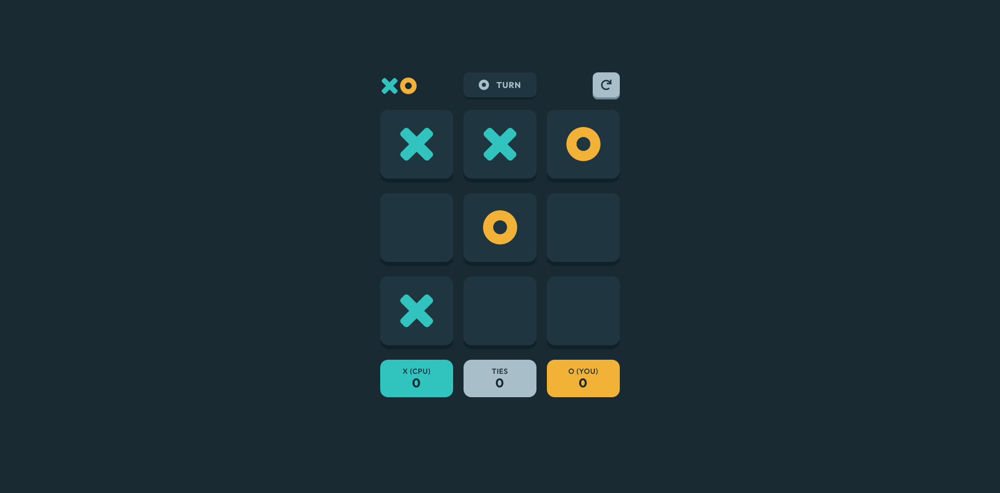

# Frontend Mentor - Tic Tac Toe solution

This is a solution to the [Tic Tac Toe challenge on Frontend Mentor](https://www.frontendmentor.io/challenges/tic-tac-toe-game-Re7ZF_E2v). Frontend Mentor challenges help you improve your coding skills by building realistic projects. 

## Table of contents

- [Overview](#overview)
  - [The challenge](#the-challenge)
  - [Screenshot](#screenshot)
  - [Links](#links)
- [My process](#my-process)
  - [Built with](#built-with)
  - [Useful resources](#useful-resources)
- [Author](#author)

**Note: Delete this note and update the table of contents based on what sections you keep.**

## Overview

### The challenge

Users should be able to:

- View the optimal layout for the game depending on their device's screen size
- See hover states for all interactive elements on the page
- Play the game either solo vs the computer or multiplayer against another person
- **Bonus 1**: Save the game state in the browser so that it’s preserved if the player refreshes their browser
- **Bonus 2**: Instead of having the computer randomly make their moves, try making it clever so it’s proactive in blocking your moves and trying to win

### Expected behaviour

- You can choose to make the default screen either the new game menu or the solo player game board. Note that we're using the solo player game board for the design screenshot, so if you choose the new game menu it won't match up in the design comparison slider. This isn't a big deal, but is something worth considering.
- On the new game screen, whichever mark isn't selected for the first player is automatically assigned to the second player when the game is started.
- The first turn of the first round is always played by whoever is playing as X. For every following round, the first turn alternates between O and X.
- After a round, if the player chooses to quit the game, they should be taken back to the new game menu.
- If the restart icon in the top right is clicked, the "Restart game?" modal should show and allow the player to reset the game or cancel and continue to play.

### Screenshot

### Links

- Live Site URL: [Website](https://zz83.github.io/tic-tac-toe-game/)

## My process

### Built with

- HTML
- CSS 
- Grid
- Flexbox
- Mobile-first workflow

### Useful resources

- [Resource 1](https://www.freecodecamp.org/news/how-to-make-your-tic-tac-toe-game-unbeatable-by-using-the-minimax-algorithm-9d690bad4b37) - This helped me add the CPU AI

## Author

- Frontend Mentor - [ZZ83](https://www.frontendmentor.io/profile/ZZ83)

